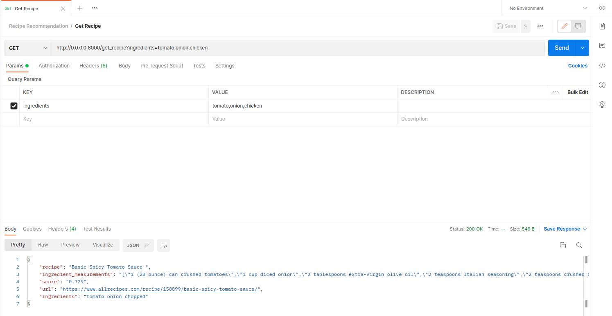

## Recipe-recommendation
A recipe recommendation system

Project Structure
--------
```sh
.
├── app.py
├── config
│   ├── config.py
│   └── __init__.py
├── Recipe Recommendation.ipynb
├── docker-compose.yml
├── Dockerfile
├── postman.png
├── README.md
├── Recipe Recommendation.postman_collection.json
├── requirements.txt
├── run.py
├── src
│   ├── api
│   │   ├── core
│   │   │   ├── __init__.py
│   │   │   └── recipe_recommendation.py
│   │   ├── dataset
│   │   │   └── recipe_dataset.csv
│   │   ├── __init__.py
│   │   └── models
│   │       └── recipe_model.pkl
│   └── __init__.py
├── tests
│   ├── __init__.py
│   └── test_base_urls.py
└── util
    ├── __init__.py
    └── logger.py
```

## Quick Start (Setup in local)

1. Clone the repo
  ```
  $ git clone 
  $ cd Recipe-recommendation
  ```


2. Initialize and activate a virtualenv:
  ```
  $ python3 -m venv env
  $ source env/bin/activate
  ```

3. Install the dependencies:
  ```
  $ pip install -r requirements.txt
  ```

5. Run the development server:
  ```
  $ python3 run.py
  ```

6. Navigate to [http://localhost:8000](http://localhost:8000)


## Docker Setup
1. Run the docker:
  ```
  $ docker-compose up --build
  ```
                OR
1. Run the docker in background:
  ```
  $ docker-compose up --build -d
  ```

2. Navigate to [http://localhost:8000](http://localhost:8000)


## Postman Collection and Screenshots
1. Postman collection in root directory:
  ```
  Recipe Recommendation.postman_collection.json
  ```


## Jupyter Notebook file
1. Jupyter Notebook file in root directory:
  ```
  Recipe Recommendation.ipynb
  ```
